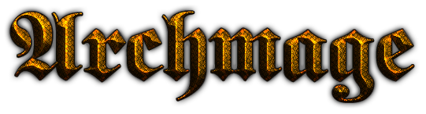

 
# The Archmage App

## Overview
Archmage is a character builder for the Pathfinder tabletop roleplaying game, using game content open via the Open Gaming License (OGL).  The rules set of the system can be found at https://www.d20pfsrd.com/.  Archmage will *likely* eventually include some house rules or tinkerings from my own ideas.

In terms of implementation, Archmage is currently an Electron app, using React and MobX for rendering and data management, Ava for testing, and Sass for styling. Because of the desire for this app to function standalone, without the need for web services or APIs (that I frankly just don't want to pay for, to say nothing of development and maintenance), at least as of the time of writing, all data stores for the app will also be committed to this repo (most likely as JSON), and any saved characters or data will be stored on the user's disk rather than anywhere in the cloud.

This is not to say that I cannot imagine a situation where the volume of data overrides the above statements.  However, for the time being, such a quantity of data is outside the scope of a home project for me.

# Tools

In order to build / develop the application, you need to have the following tools installed:
* nodejs - v10 https://nodejs.org/en/
* yarn   - https://yarnpkg.com/en/

# Setup
```
yarn
```
In the root folder of the repo, run yarn to download all of the external components necessary.

# Workflow

```bash
# run application in development mode
yarn dev

# build distrubution files - installer for current platform
yarn dist

# run automated test suite
yarn test

# run automated test suite with 'hot re-testing' as you change files
yarn test:watch
```

#### Note on Logo
Archmage Logo generated from https://cooltext.com/Logo-Design-Sword.  It's really just a placeholder to look cool for now.
